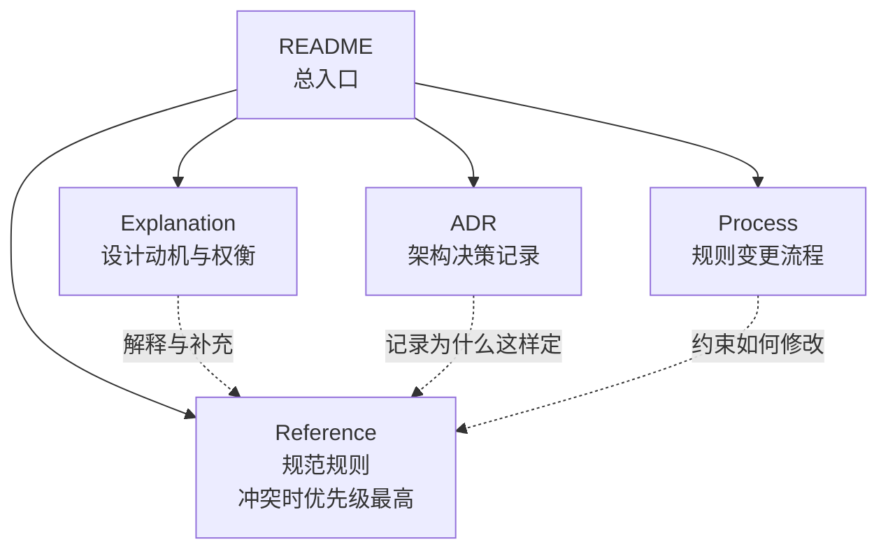
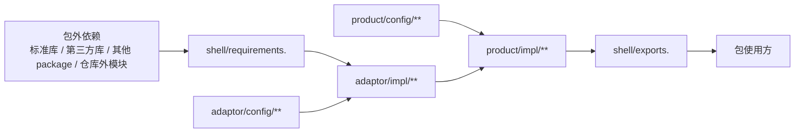
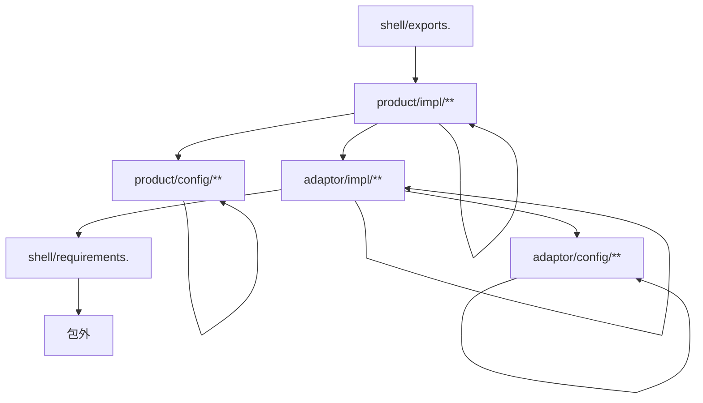
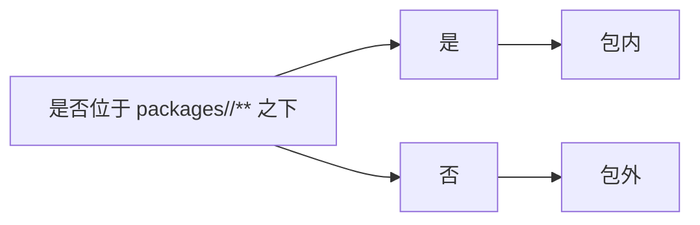
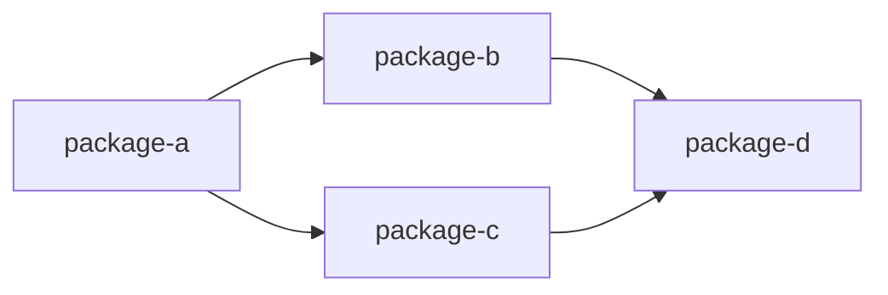
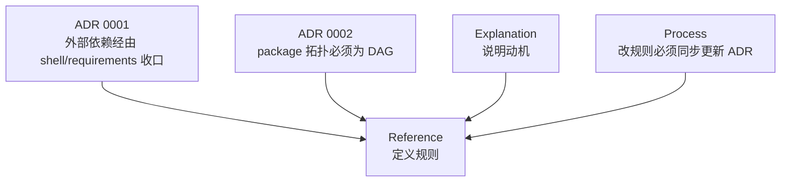

# 中文架构图

本文把当前仓库中的规则、解释、流程和 ADR 整理成中文架构图，方便快速理解整套设计。

## 1. 文档体系总览



含义：

- `Reference` 是单一事实来源，定义 MUST / MUST NOT / SHOULD。
- `Explanation` 解释规则为什么存在，以及设计取舍。
- `ADR` 记录重大架构决策的背景、决策和后果。
- `Process` 规定后续如何修改规范。

## 2. 单个 Package 的结构图

每个包位于 `packages/<package>/`，至少包含如下结构：

```text
packages/<package>/
├─ product/
│  ├─ config/
│  └─ impl/
├─ adaptor/
│  ├─ config/
│  └─ impl/
├─ shell/
│  ├─ requirements.<ext>
│  └─ exports.<ext>
├─ docs/      (可选附件目录)
└─ assets/    (可选附件目录)
```

## 3. 单个 Package 的依赖方向图



核心规则：

- 只有 `shell/requirements.<ext>` 可以直接依赖包外内容。
- `adaptor/impl/**` 负责接住 `requirements` 暴露出来的外部能力，并转换成包内可用形式。
- `product/impl/**` 只组合产品逻辑，不直接接触包外依赖。
- `shell/exports.<ext>` 是推荐给包使用方依赖的稳定出口。

## 4. 依赖约束矩阵



可直接理解为：

- `product/config` 只能依赖 `product/config`
- `adaptor/config` 只能依赖 `adaptor/config`
- `shell/requirements` 只能依赖包外，不能依赖包内
- `adaptor/impl` 只能依赖 `adaptor/config`、自己、`shell/requirements`
- `product/impl` 只能依赖 `product/config`、自己、`adaptor/impl`
- `shell/exports` 只能依赖 `product/impl`

## 5. 为什么标准库也算包外



判断标准非常绝对：

- 只要不在 `packages/<package>/**` 下面，就算包外。
- 因此标准库、第三方库、其他 package、仓库根目录公共代码都属于包外。
- 这样规则才容易机械检查，不需要靠人为解释“这个依赖算不算特殊情况”。

## 6. 仓库级 Package 关系图

仓库中所有 package 的依赖关系必须形成 DAG，也就是有向无环图。



允许：

- 一个 package 依赖多个 package
- 多个 package 共同依赖同一个共享 package

不允许：

- `A -> B -> C -> A` 这类循环依赖

## 7. 规则、解释、决策、流程之间的关系



可以把它理解成：

- `Reference` 说“规则是什么”
- `Explanation` 说“为什么这样设计”
- `ADR` 说“当时为什么做出这个决定”
- `Process` 说“以后改规则时要遵守什么步骤”

## 8. 一句话总结

这套架构的目标是：

- 在包内把外部依赖集中收口，提升封装性、可测试性和可审计性；
- 在仓库级禁止 package 环状依赖，让 package 保持可拆分、可重构、可独立演进。
